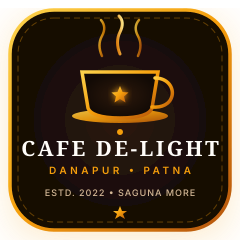

# 🌟 Cafe De-Light — Danapur &amp; Saguna More, Patna
### *Where Flavors Meet Warm Delight &bull; Danapur's Favorite Multicuisine Destination*

 

[-F59E0B?style=for-the-badge&logo=google-maps&logoColor=white)](https://www.justdial.com/Patna/Cafe-De-Light-Saguna-More/0612PX612-X612-220330201538-K7H7_BZDET)
[-4285F4?style=for-the-badge&logo=google&logoColor=white)](#-location--operating-hours)

 

  
  
  
  
  

[✨ Experience & Highlights](#-experience--key-features) • [📹 HD Video Tour](#-authentic-video-tour) • [🍽️ Menu Highlights](#%EF%B8%8F-culinary-repertoire) • [📍 Location & Contact](#-location--operating-hours)

---

## 📖 Overview

**Cafe De-Light** is an authentic, high-converting digital web portal built for Patna’s beloved dining and hangout destination located at **Balaji Nagar, Kaliket Nagar, Danapur, Saguna Khagaul Road, Saguna More, Patna - 801503, Bihar**.

Established in 2022, Cafe De-Light serves over 100+ multicuisine specialties including authentic Steamed and Kurkure Momos, sizzling Chilli Chicken, slow-cooked Dum Biryani, cheesy Pizzas, Pasta, and artisan cold brews in a fully air-conditioned, neon-lit cozy ambiance.

---

## ✨ Experience & Key Features

* **🌓 Dual-Mood Ambience (Dark & Light Mode)**:
  - **Obsidian Espresso (Dark)**: Deep cafe tones with glowing amber-gold accents (`#F59E0B`) tailored for evening dinners.
  - **Sunlit Cream (Light)**: Warm latte and ivory palette for afternoon brunches.
  - State dynamically persists across visits via `localStorage`.

* **📹 Authentic HD Video Tour Player**:
  - Embedded real video tour (`videos/cafe_delight_tour.mp4`) with custom progress bar scrubbing, play/pause controls, and picture-in-picture mode.

* **🥟 Interactive Culinary Menu with Filter Tabs**:
  - Filterable by *Momos & Starters*, *Pan-Asian & Chinese*, *North Indian & Biryani*, *Continental & Pizza*, and *Artisan Beverages*.
  - Instant WhatsApp direct-ordering integration for every single dish.

* **📸 Bento-Grid Photo Gallery**:
  - 16+ downloaded authentic high-resolution images showcasing real dining halls, ambient lighting, private booths, and dishes.
  - Interactive Lightbox with keyboard navigation.

* **📅 Instant Table Reservation with WhatsApp Sync**:
  - Client-side validated reservation form with guest count, date/time picker, and special occasion notes.
  - Generates pre-filled WhatsApp confirmation sent directly to Cafe De-Light (`+91 79030 29008`).

* **💬 Intelligent AI Cafe Assistant**:
  - On-page interactive chatbot with verified knowledge about Cafe De-Light's menu, prices, timings, and location.

---

## 🍽️ Culinary Repertoire

| Category | Specialty Highlights | Average Price |
| :--- | :--- | :--- |
| **🥟 Momos & Crispy Starters** | Steamed Veg/Chicken Momos, Kurkure Momos, Crispy Chilli Babycorn | ₹110 – ₹180 |
| **🥢 Pan-Asian & Chinese** | Chilli Chicken (Dry/Gravy), Chicken Hakka Noodles, Veg Manchurian | ₹160 – ₹260 |
| **🍛 North Indian & Biryani** | Cafe De-Light Special Dum Biryani, Paneer Butter Masala, Kadhai Chicken | ₹180 – ₹270 |
| **🍕 Continental & Italian** | Farmhouse Cheese Pizza, Creamy Alfredo Pasta, Cheese Garlic Bread | ₹130 – ₹240 |
| **☕ Artisan Beverages & Drinks** | Signature Cold Coffee with Ice Cream, Blue Lagoon, Oreo Thick Shake | ₹120 – ₹150 |

---

## 📍 Location & Operating Hours

* **Address:** Balaji Nagar, Kaliket Nagar, Danapur, Saguna Khagaul Road, Saguna More, Patna - 801503, Bihar
* **GPS Coordinates:** Lat: `25.620249`, Lng: `85.0417412`
* **Direct Navigation:** [Google Maps Directions](https://www.google.com/maps/dir/?api=1&destination=25.620249,85.0417412)
* **Phone Numbers:** `+91 79030 29008` &bull; `+91 88629 84404`
* **Operating Hours:** Monday to Sunday: 11:00 AM – 11:00 PM (Open 7 Days a Week)
* **Price for Two:** ₹650 – ₹800 approx.
